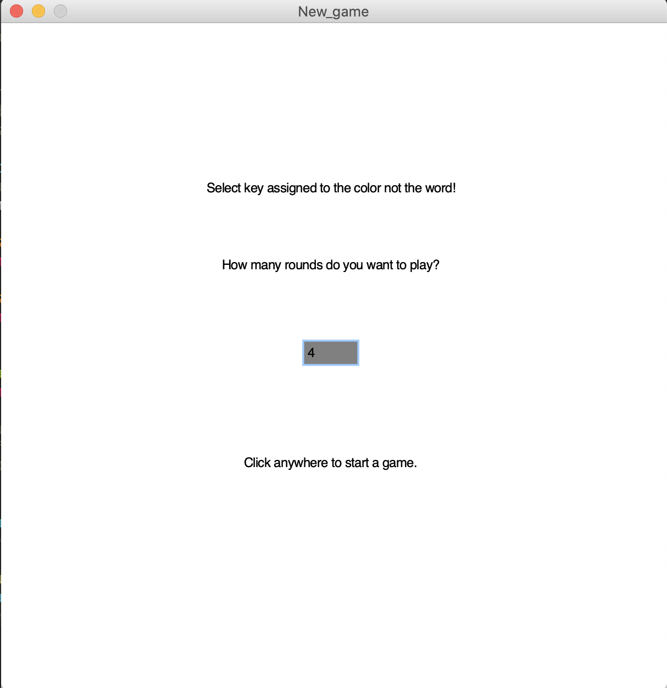
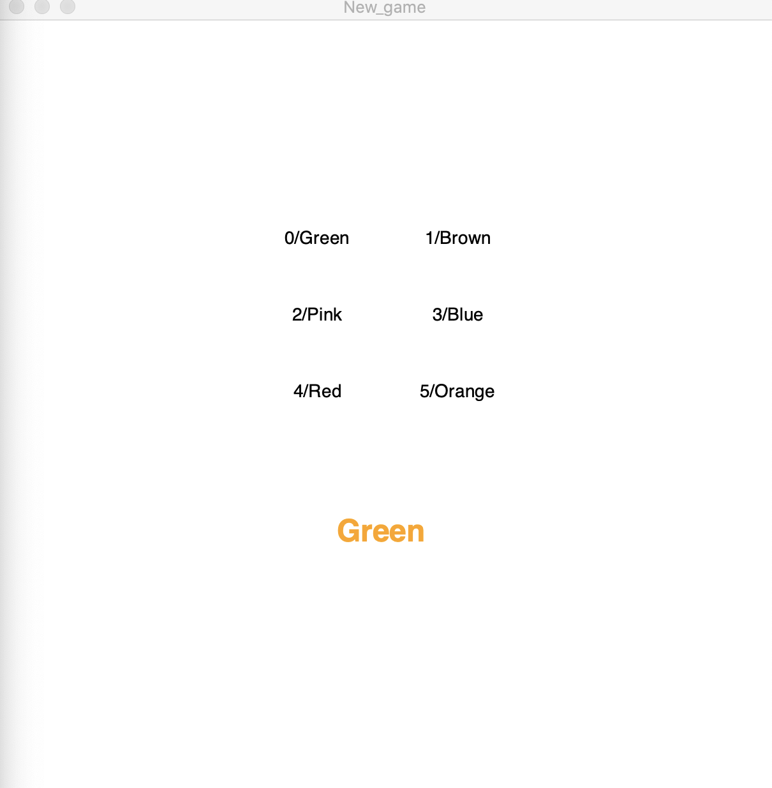
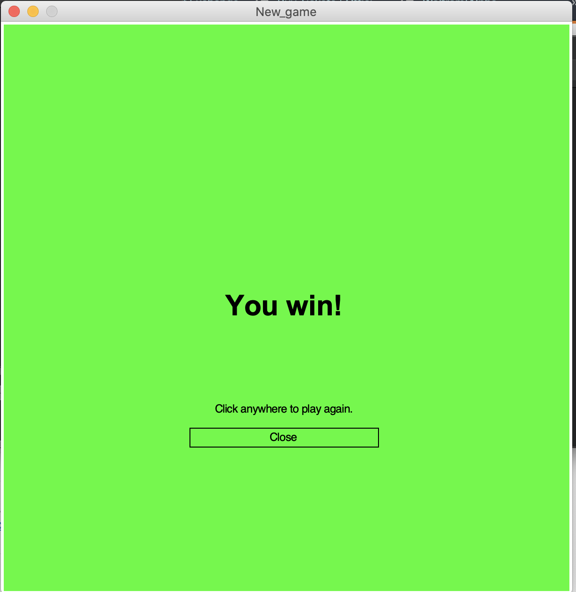
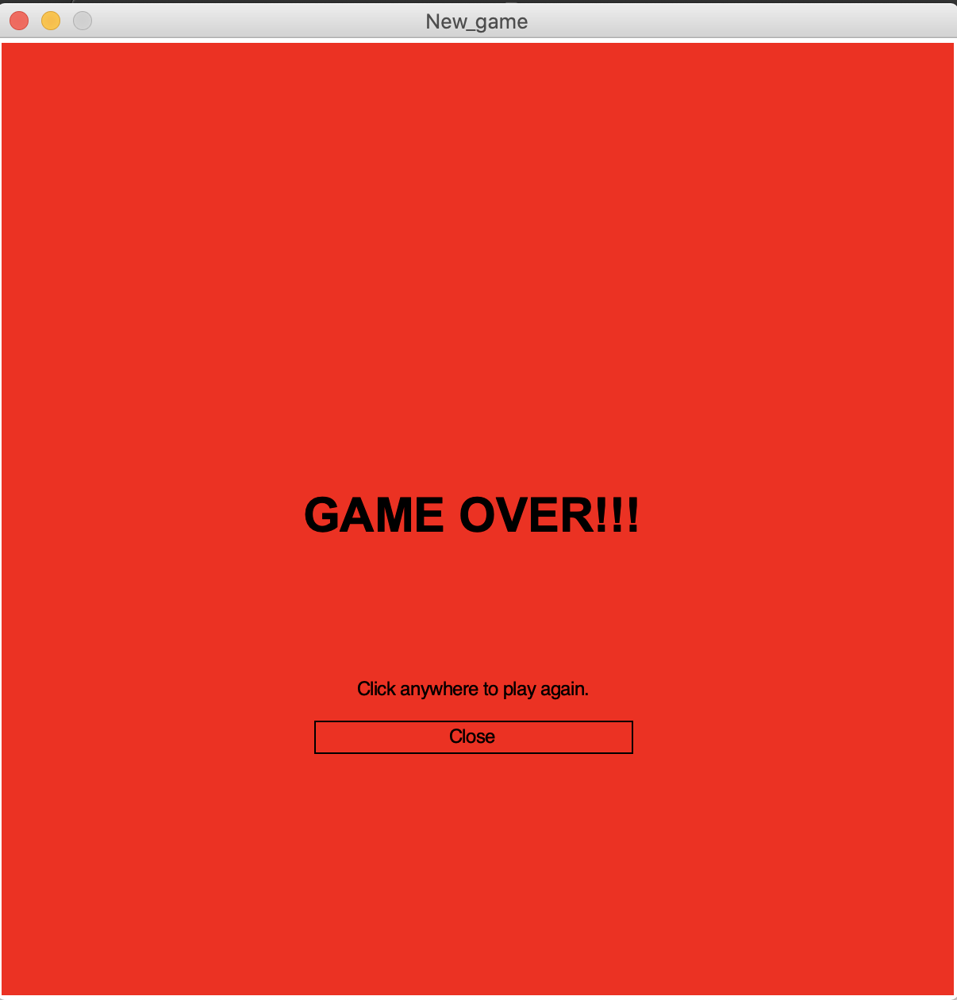

# "Pick the Colour ot the Name" Game
A simple game where the user picks a colour from list. Made in python using the graphics module.

1. The game opens graphics window where the user can choose how many games it wants to play. Then the user can press to play.
2. The game starts and the user clicks on the number on the keyboard corresponding to the displayed colour. The options are randomly generated (6 from 9 possible).

